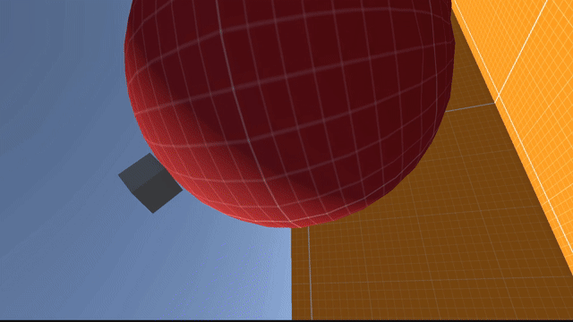

# gravity-fps-controller

## Gravity Character Controller for Unity

A custom character controller that allows to have a different gravity directions in specific areas 

and around spheres.

## Features
- Input handling
- Smooth movement, rotation and jumps
- Camera rotation system
- Custom ground detection
- High customizability
- Linear and spherical gravity fields

## Installation

### Option 1: Unity Package (Recommended)
Download the latest .unitypackage which includes scripts, player prefab and a demo scene.

### Option 2: Manual Installation
1. Copy all files from the `Scripts/` and 'Prefabs/' folders.
2. Paste into your Unity project.
3. Create an object in your scene and add 'Interpolation Controller' script to it.
4. In Project Settings / Script Execution Order, make sure that 'InterpolationController' is -100, 'InterpolatedTransform' is -50, 'InterpolatedTransformUpdater' is 100.
5. Add the Player prefab to the scene.
6. Add the GravityField prefabs to whatever object you want.

## Requirements
- Legacy Input Manager (or adapt for New Input System yourself)

## License 
MIT License - see LICENSE file
